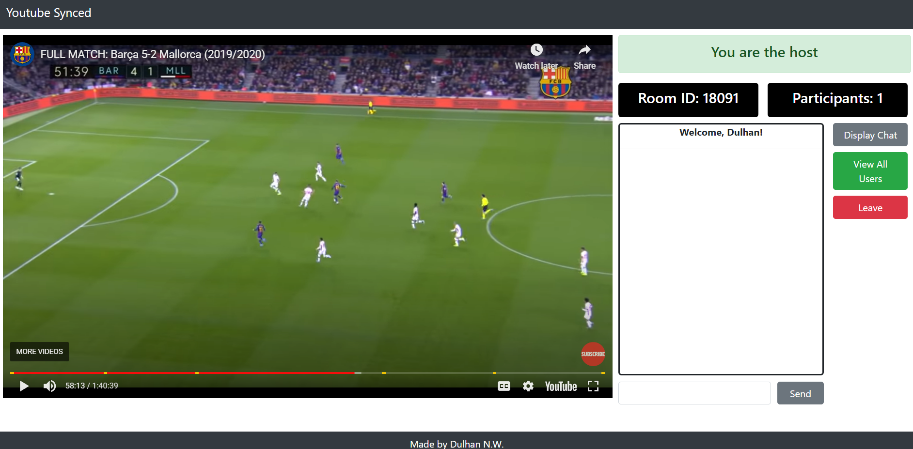

# YouTube Synced

This is a web app that allows users to watch YouTube videos together in sync. They are also able to chat along as they watch. The live site can be found <a href = "https://youtube-synced.herokuapp.com/"> here. </a>

## Motivation

Ever been in a Zoom or Webex lecture and the host tried to stream a YouTube video? You may have noticed that the video lags a lot and is overall bad quality. This web app aims to provide an alternative solution to streaming those YouTube videos.

## How it Works

Anyone can create a room by entering a valid URL of a YouTube vdeo. Users can access a room by entering the room code associated with the room (which the host can give out). Inside the room, all users' videos are in sync with the host user's video. However, any user can choose to pause or scroll a video and become out of sync. Whenever, they want to sync back up, they just need to press a single button. The host can also change the video state, which changes it for all the users watching.

The synchronization of the videos is mainly configured with Socket.io, which acts as a wrapper for WebSocket connections.

*Please note that since the site is hosted on Heroku for free, there may be some lags when navigating to the video page. It might require a couple of tries.*

## How it Looks

The home page

 The video player page

